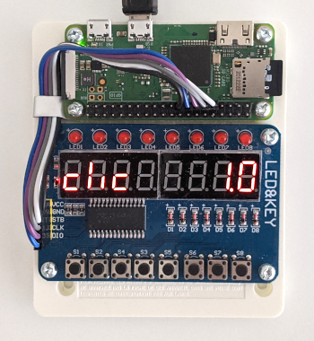

# autoclicker
open-source hardware autoclicker

[video](https://youtu.be/59LoqYHKqVw)


### hardware
- Raspberry Pi Zero WH
- TM1638 (see picture)
- jumper wires
- SD card 4GB
- micro USB cable



### pins connections

| TM1638 | Raspberry Pi |
| ------ | ------------ |
| VCC    | 17 3.3v      |
| GND    | 09 Ground    |
| STB    | 11 GPIO17    |
| CLK    | 13 GPIO27    |
| DIO    | 15 GPIO22    |

### enable ssh
```
sudo raspi-config
3 Interface Options
11 SSH
<Yes>
<Ok>
<Finish>
```
ssh raspberrypi.local

### java
```
sudo apt update
sudo apt install openjdk-17-jdk
```

### create hid_gadget_test
manually copy hid_gadget_test.c from https://www.kernel.org/doc/html/v5.4/usb/gadget_hid.html
```bash
gcc hid_gadget_test.c -o hid_gadget_test
```

### remove symlink
```
ls -l /dev/gpiochip*
sudo rm /dev/gpiochip4
```

### enable linux hid

/boot/firmware/config.txt
```
...
dtoverlay=dwc2
```

### autostart
/etc/rc.local
```
#!/bin/sh -e

cd /home/user
sh autoclicker.sh
```

```
sudo chmod a+x /etc/rc.local
```
